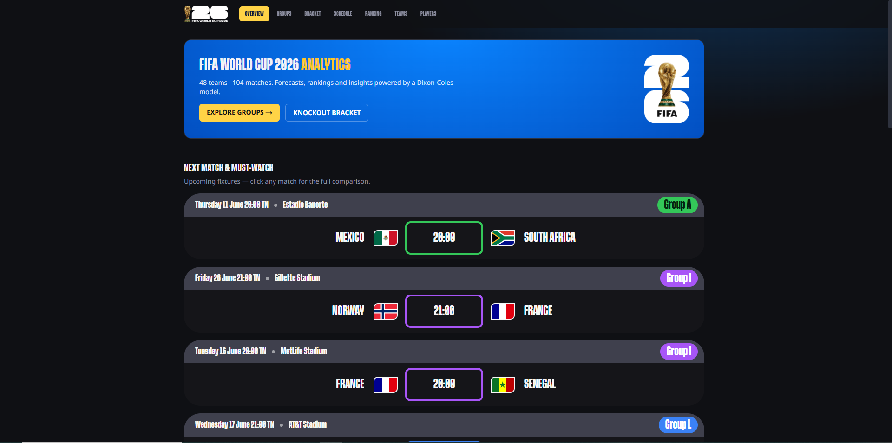
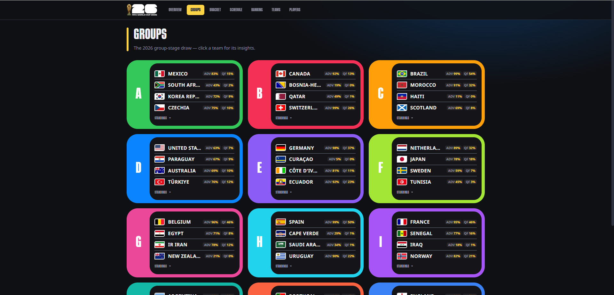
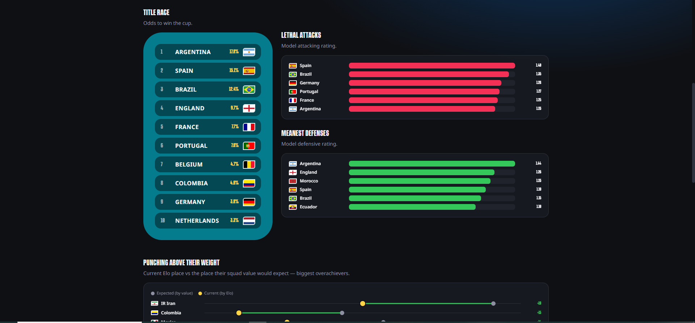
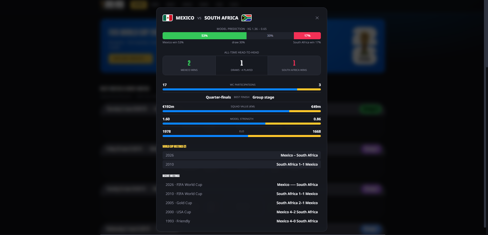

# FIFA World Cup 2026 — Analytics

An end-to-end data + AI engineering project for the **FIFA World Cup 2026**: a Python
pipeline builds a football warehouse, a Dixon-Coles model simulates the tournament,
and a themed Next.js web app turns it into an interactive analytics hub — predictions,
rankings, head-to-head history and insight dashboards.

**Live demo**
- 🌐 **Web app (Vercel): https://worldcup-2026-analytics.vercel.app**
- ⚙️ API (Render): https://wc2026-api-kinp.onrender.com/api/health

> The data is pre-tournament; results, standings and form fill in as matches are played.

---

## Screenshots

| Landing — next match & must-watch | Groups (draw + qualification odds) |
|---|---|
|  |  |

| Insight dashboard (title race · attacks · defenses) | Match comparison modal (prediction · H2H) |
|---|---|
|  |  |

---

## Features

- **Landing dashboard** — next match + must-watch fixtures, **title race**, **punching above their weight** (Elo vs squad-value, dumbbell chart), **lethal attacks / meanest defenses**, **star power**, **form guide**, **dark horses** and the **group of death**.
- **Groups** — the 2026 draw as colour-coded cards with **qualification odds** (Advance / QF) per team and an expandable standings table.
- **Knockout bracket** — the official R32 → Final slot template.
- **Schedule** — fixtures grouped by matchday, kickoff times shown in **Tunisia (UTC+1)**.
- **World ranking** — every nation ranked by **Elo / champion odds / squad value / attack / defense** (switchable).
- **Teams & team pages** — squad value, model strength, WC history, coach, top players.
- **Match comparison modal** — model prediction (W/D/L + xG), all-time **head-to-head**, World Cup meetings, and FlashScore-style stat bars.
- Offline-bundled flags & kits, the FWC2026 display font, and a trophy page transition.

---

## Design

Built from a **FIFA World Cup 2026 Figma design system** — royal-blue boards, neon
per-group colours, white "flag container" tiles with the signature diagonal corners,
and dark insight surfaces.

- **Fonts:** `FWC2026` (display) + `Noto Sans` (body) — *Free for Personal Use.*
- **Palette, components and screens** were matched from Figma Dev-Mode specs.

> Figma source: [FIFA World Cup 2026 — Community](https://www.figma.com/design/rti3tkIgUUVlgv8dwrTIdt/FIFA-World-Cup-2026--Community-?node-id=361-536404)

---

## Architecture

```
  Sources        FBref · Transfermarkt · martj42 international results
                        │
  Pipeline (Python) ────┘     Dagster orchestration → dbt transforms
                        ▼
  Warehouse        DuckDB (local file)  ⇄  MotherDuck (cloud, CI)
                        ▼
  Model            Dixon-Coles + squad-value prior · 20k Monte-Carlo sims
                        ▼
  API (FastAPI)    read-only JSON over the marts  ──►  Render
                        ▼
  Web (Next.js 16) themed analytics UI            ──►  Vercel
```

**Tech stack:** Next.js 16 · React 19 · Tailwind v4 · TypeScript · FastAPI · DuckDB ·
dbt · Dagster · pandas · Python 3.11.

---

## Local development

**1. Backend API** (Python)

```powershell
python -m venv .venv
.\.venv\Scripts\Activate.ps1
pip install -r requirements-api.txt          # slim runtime deps
$env:PYTHONPATH = "src"
uvicorn wc2026.api:app --reload --port 8000   # → http://localhost:8000/api/health
```

> Rebuilding the warehouse from scratch (Dagster + dbt) uses the full deps:
> `pip install -e ".[dev]"` then `dagster asset materialize -m wc2026.definitions --select "*"`.

**2. Frontend** (Next.js)

```powershell
cd frontend
npm install
npm run dev                                   # → http://localhost:3000
```

The frontend reads `NEXT_PUBLIC_API_URL` (defaults to `http://localhost:8000`); set it in
`frontend/.env.local` to point elsewhere.

---

## Deployment

The app is split across two free hosts. Full click-by-click is in **[DEPLOY.md](DEPLOY.md)**.

**Backend → Render** (read-only FastAPI + the committed 8.5 MB DuckDB)
1. Render → **New → Blueprint** → pick this repo. It reads [`render.yaml`](render.yaml) and
   builds from [`requirements-api.txt`](requirements-api.txt).
2. Deploy → grab the URL → verify `/api/health`.

**Frontend → Vercel** (Next.js)
1. Import the repo, set **Root Directory = `frontend`**.
2. Add env var `NEXT_PUBLIC_API_URL` = your Render URL (no trailing slash).
3. Deploy. Every push to `main` then auto-redeploys.

> Render's free tier sleeps when idle, so the first request after a nap is a ~30–60 s cold start.

---

## Project layout

```
frontend/              Next.js 16 web app
  app/                 routes: landing, groups, bracket, schedule, ranking, teams, players
  components/          MatchCard, GroupCard, RankingList, charts, brand primitives, modal
  lib/                 typed API client, insights, timezone, WC-history reference data
  public/brand/        bundled flags (SVG), kits, fonts, logos
src/wc2026/            Python package
  api.py               FastAPI read-only service (teams, groups, fixtures, predictions,
                       strengths, players, h2h, form, predict)
  config.py            DuckDB / MotherDuck connection switching
  models/              Dixon-Coles model + Monte-Carlo simulation
  branding.py          flag ISO mapping
dbt/                   dbt project (staging → marts)
data/wc2026.duckdb     prebuilt read-only warehouse (committed for the deployed API)
render.yaml            Render Blueprint (backend)
DEPLOY.md              deployment guide
```

---

## Data sources (all free)

- **FBref** via [`soccerdata`](https://github.com/probberechts/soccerdata) — squads & player stats
- **Transfermarkt** — market values
- **martj42 international results** — 49k+ historical internationals (head-to-head & form)
- Flags by [`flag-icons`](https://github.com/lipis/flag-icons)

## Notes

- The `FWC2026` / `fifa-26` fonts are **Free for Personal Use** — check licensing before any commercial deployment.
- Built by **Mohamed Sahbi Ben Rejeb**.
